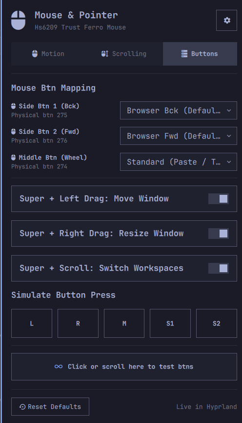

# Mouse & Pointer Settings (`meviusisback.mouse-settings`)

[](https://omarchy.org)
[](LICENSE)
[](https://hyprland.org)

A modern, secure, and intuitive graphical mouse and pointer configuration tool for [Omarchy Linux](https://omarchy.org). Adjust cursor speed, toggle between 1:1 precision and adaptive acceleration, customize scroll behavior, remap extra mouse buttons, simulate button presses, and test input events in real time—all with instant Hyprland application and zero config breakage.


<p align="center">
  
</p>
---

## 📑 Table of Contents

- [✨ Key Features](#-key-features)
- [🖥️ UI & Feature Walkthrough](#️-ui--feature-walkthrough)
  - [Top Bar Widget](#top-bar-widget)
  - [Motion & Pointer Dynamics](#motion--pointer-dynamics)
  - [Scrolling & Focus Behavior](#scrolling--focus-behavior)
  - [Mouse Button Remapping](#mouse-button-remapping)
  - [Interactive Testing Canvas](#interactive-testing-canvas)
- [📦 Installation](#-installation)
- [⌨️ IPC & CLI Integration](#️-ipc--cli-integration)
- [🔒 Security & Architecture](#-security--architecture)
- [📁 Configuration & Files](#-configuration--files)
- [📜 License](#-license)

---

## ✨ Key Features

- **⚡ Zero Restart Required**: Changes apply instantly to Hyprland via runtime evaluation and persist reliably across reboots.
- **🎯 One-Click Precision Mode**: Switch instantly between raw 1:1 flat input (ideal for gaming & design) and dynamic acceleration with a right-click on the top bar or via IPC.
- **🔘 Customizable Button Remapping**: Rebind physical mouse buttons (Side Btn 1, Side Btn 2, Middle Click) to productivity actions like workspace switching, terminal launch, or window management.
- **📜 Multiplier & Natural Scrolling**: Adjust scroll sensitivity up to 8.0x and toggle natural (touchpad/macOS-style) direction.
- **🛡️ Enterprise-Grade Reliability**: Built with atomic writes (`os.replace` + `fsync`), POSIX concurrency file locks (`fcntl.flock`), symlink attack prevention, and strict parameter allowlists.
- **🧪 Live Input Verification**: Built-in interactive test canvas confirms button presses, side keys, and scroll directions immediately.
- **🖱️ Simulate Any Button Press**: Emit real synthetic presses of Left, Right, Middle (274), Side Bck (275), or Side Fwd (276) from the Buttons tab or the CLI — test button remaps and Hyprland binds without having the physical buttons (powered by `ydotool`).
- **🔋 Mouse Battery Indicator**: Shows the remaining battery percentage of your wireless mouse in the panel header and tooltip (via `upower`) — automatically hidden when the mouse does not report a battery, and never confused with other peripherals' batteries.
- **🎯 Smart Device Detection**: Identifies your actual mouse even when keyboards and virtual devices appear in Hyprland's pointer list.

---

## 🖥️ UI & Feature Walkthrough

```
┌────────────────────────────────────────────────────────┐
│  󰍽  Mouse & Pointer                      󰒓 [Config]    │
│     Razer DeathAdder V2 · Precision (1:1) · Standard   │
├────────────────────────────────────────────────────────┤
│   [ 󰍽 Motion ]       [ 󱕒 Scrolling ]      [ 󰒋 Buttons ] │
├────────────────────────────────────────────────────────┤
│  Cursor Speed: Fast (1.25x)                            │
│  🐢 ─────────────●──────────── 🚀                     │
│                                                        │
│  Pointer Movement Style                                │
│  ┌────────────────────────┐  ┌──────────────────────┐  │
│  │ 󰓅 Precision (1:1)      │  │ 📈 Dynamic (Adaptive)│  │
│  │ Gaming & Precision Work│  │ Smooth Desktop Curve │  │
│  └────────────────────────┘  └──────────────────────┘  │
│                                                        │
│  [X] Left-Handed Mode (Swap Left/Right Click)          │
├────────────────────────────────────────────────────────┤
│  [ 󰁯 Reset Defaults ]               ✓ Live in Hyprland │
└────────────────────────────────────────────────────────┘
```

### Top Bar Widget

- **Status Icon (`󰍽`)**: Clean visual indicator in your Omarchy top bar. Highlights when **Precision Mode (Flat)** is active.
- **Rich Tooltip**: Hovering reveals the primary device name, active acceleration profile, and current speed multiplier (e.g. `Logitech G502 · Precision (1:1) · Fast (1.20x)`).
- **Left-Click**: Toggles the interactive settings card.
- **Right-Click Fast Toggle**: Instantly flips between **Precision (Flat 1:1)** and **Dynamic (Adaptive)** acceleration, broadcasting desktop notifications.

---

### Motion & Pointer Dynamics

1. **Cursor Speed Slider**:
   - Fine-grained range from `-1.0` (Slow / 0.0x) to `+1.0` (Fast / 2.0x) with step increments of `0.05`.
   - Labeled with emoji guides (`🐢` Slow to `🚀` Fast) and formatted multiplier labels (`Standard (1.0x)`, `Fast (1.30x)`, `Slow (0.75x)`).
2. **Movement Profile Cards**:
   - **Precision (1:1 / Flat)**: Disables software acceleration curve. Every count of physical mouse movement translates to a fixed pixel distance. Essential for competitive gaming, CAD, and precision pixel work.
   - **Dynamic (Adaptive)**: Standard OS curve that accelerates pointer velocity during fast swipes while preserving pinpoint control during slow movements.
3. **Left-Handed Mode**:
   - Swaps primary and secondary physical buttons (`left_handed = true` in Hyprland) for comfortable southpaw usage.

---

### Scrolling & Focus Behavior

1. **Natural (Mobile) Scrolling**:
   - When enabled, moving the wheel downward scrolls content downward (matching touchscreens and macOS touchpads).
   - When disabled, uses traditional PC wheel scrolling.
2. **Scroll Speed Multiplier**:
   - Adjusts scroll step sensitivity from `0.2x` (`🐌`) up to `8.0x` (`⚡`) in `0.2` increments.
   - Boosts navigation speed on high-resolution displays or long documents.
3. **Focus Follows Cursor**:
   - Automatically activates window focus as the pointer hovers over different client surfaces.
4. **Auto-Refocus on App Close**:
   - Automatically shifts focus to the window currently directly underneath the cursor when the active window is closed.

---

### Mouse Button Remapping

Easily customize non-standard physical buttons and gesture shortcuts:

| Physical Button / Gesture | Linux Keycode / Event | Configurable Actions |
| :--- | :--- | :--- |
| **󰍽 Side Btn 1 (Bck)** | `mouse:275` | • **Browser Bck (Default)**<br>• **Prev Workspace** (`workspace, e-1`)<br>• **Omarchy Menu** (`exec, omarchy-menu`)<br>• **Focus Prev Window** (`movefocus, l`) |
| **󰍽 Side Btn 2 (Fwd)** | `mouse:276` | • **Browser Fwd (Default)**<br>• **Next Workspace** (`workspace, e+1`)<br>• **Launch Terminal** (`exec, omarchy-terminal`)<br>• **Focus Next Window** (`movefocus, r`) |
| **󰍽 Middle Btn (Wheel)** | `mouse:274` | • **Standard (Paste / Tab)** (Default pass-through)<br>• **Close Active Window** (`killactive`)<br>• **Toggle Floating** (`togglefloating`)<br>• **Toggle Fullscreen** (`fullscreen, 1`) |
| **Super + Left Drag** | `SUPER + mouse:272` | • **Move Window** (`movewindow`) or **Disabled** |
| **Super + Right Drag** | `SUPER + mouse:273` | • **Resize Window** (`resizewindow`) or **Disabled** |
| **Super + Wheel Scroll** | `SUPER + mouse_up/down` | • **Switch Workspaces** (`workspace, e-1 / e+1`) or **Disabled** |

Below the remapping dropdowns, the **Simulate Button Press** row offers five equal-width chips (`L`, `R`, `M`, `S1`, `S2`). Clicking one sends a synthetic press of that physical button via `ydotool` — it feeds a real input event into Hyprland, so remapped actions fire and the interactive testing canvas below reports the detection exactly as if you had pressed the hardware button. Requires the `ydotoold` daemon (see Installation).

**Battery Indicator**: When your mouse reports a battery level over HID (most Logitech and newer wireless mice do), the remaining percentage appears next to the device name in the popup header and in the bar icon tooltip, sourced via `upower`. Mice whose firmware does not expose the HID battery page (many budget 2.4 GHz receivers) simply show no indicator.

---

### Interactive Testing Canvas

Located at the bottom of the Buttons tab, the interactive test box gives immediate feedback:
- **Button Clicks**: Detects `Left Btn`, `Right Btn`, `Middle Btn (274)`, `Side Btn 1 (Bck / 275)`, and `Side Btn 2 (Fwd / 276)` alongside an incrementing click counter.
- **Scroll Events**: Detects wheel direction (`Scrolled Up` / `Scrolled Down`) and reports raw angle deltas.
- **Safe Sandboxing**: Uses QML `Text.PlainText` rendering to ensure hardware device names and event strings cannot execute rich text formatting or script injections.

---

## 📦 Installation

### Via Omarchy Plugin Manager (Recommended)

Install and enable with a single command:

```bash
omarchy plugin add https://github.com/meviusisback/mouse-settings --enable
```

### Manual Installation

Prerequisite for button simulation:

```bash
sudo pacman -S ydotool
systemctl --user enable --now ydotool.service
```

Not required for core settings — the plugin manager command above works from any git URL and
handles updates via `omarchy plugin update`. Cloning by hand into
`~/.config/omarchy/plugins/` is discouraged: it skips manifest-managed
lifecycle and will not be tracked for updates.

---

## ⌨️ IPC & CLI Integration

The plugin exposes full IPC targets via `omarchy-shell` and a standalone Python helper for scripts, keybindings, and macro pads.

### Omarchy Shell IPC

```bash
# Toggle settings popup open/close
omarchy-shell meviusisback.mouse-settings toggle

# Fast toggle Precision Mode (Flat 1:1) vs Dynamic
omarchy-shell meviusisback.mouse-settings toggleAccel

# Explicit open / close
omarchy-shell meviusisback.mouse-settings open
omarchy-shell meviusisback.mouse-settings close
```

### Direct CLI Helper (`mouse_ctl.py`)

```bash
# Query full JSON state of mouse configuration
python3 ~/.config/omarchy/plugins/meviusisback.mouse-settings/mouse_ctl.py status

# Toggle acceleration profile directly
python3 ~/.config/omarchy/plugins/meviusisback.mouse-settings/mouse_ctl.py toggle-accel

# Toggle natural scroll direction
python3 ~/.config/omarchy/plugins/meviusisback.mouse-settings/mouse_ctl.py toggle-natural-scroll

# Apply specific settings via JSON
python3 ~/.config/omarchy/plugins/meviusisback.mouse-settings/mouse_ctl.py apply --json-data '{
  "sensitivity": 0.2,
  "accel_profile": "flat",
  "natural_scroll": false,
  "scroll_factor": 1.4,
  "button_mappings": {
    "side_back": "prev_workspace",
    "side_forward": "next_workspace",
    "middle_click": "toggle_floating"
  }
}'

# Reset all mouse settings and button bindings to defaults
python3 ~/.config/omarchy/plugins/meviusisback.mouse-settings/mouse_ctl.py reset-defaults

# Simulate a physical mouse button press via ydotool
python3 ~/.config/omarchy/plugins/meviusisback.mouse-settings/mouse_ctl.py simulate-button --button side_back   # left|right|middle|side_back|side_forward
```

---

## 🔒 Security & Architecture

The plugin is engineered specifically to prevent configuration corruption, race conditions, and injection vulnerabilities:

1. **Non-Destructive Scoped Markers**:
   Settings are written exclusively inside dedicated, marked blocks in `~/.config/hypr/input.lua` and `~/.config/hypr/bindings.lua`. All user rules, comments, and manual configurations outside these marker blocks are completely preserved:
   ```lua
   -- [[ OMARCHY_MOUSE_SETTINGS_START ]]
   -- Generated by meviusisback.mouse-settings plugin.
   return {
     sensitivity = 0.0,
     accel_profile = "flat",
     follow_mouse = 1,
     natural_scroll = false,
     left_handed = false,
     scroll_factor = 1.0,
     mouse_refocus = true,
   }
   -- [[ OMARCHY_MOUSE_SETTINGS_END ]]
   ```
2. **Atomic Writes & Safe Replacement**:
   Configuration files are written to unique temporary files in the same directory (`.tmp_*`), flushed and synchronized with `os.fsync()`, and moved into place via atomic `os.replace()`. This prevents zero-byte or corrupt files if a write is interrupted.
3. **Concurrency Locking (`fcntl.flock`)**:
   An exclusive file lock (`~/.config/hypr/.mouse_ctl.lock`) synchronizes all read-modify-write operations, preventing race conditions from simultaneous UI interactions or background scripts.
4. **Symlink Attack Mitigation**:
   Before updating a file, `safe_atomic_write` checks `is_symlink()`. If a symlink is present, it is unlinked rather than followed, guaranteeing that external target files cannot be overwritten.
5. **Strict Input Validation & Bounding**:
   - Floats (`sensitivity`, `scroll_factor`) are strictly verified to be finite numbers (`math.isnan` and `math.isinf` rejected) and clamped within safe ranges.
   - Enums (`accel_profile`, `button_mappings`) are matched against strict compile-time allowlists.
   - Subprocesses are spawned using list arguments (`shell=False`) to eliminate shell injection risks.
6. **UI Debounce & Sanitization**:
   Rapid hardware toggle actions are rate-limited via client-side debouncing, and all dynamic strings are bound using `Text.PlainText`.

---

## 📁 Configuration & Files

- `manifest.json`: Plugin registration, metadata, bar widget definition, and category bindings.
- `Panel.qml`: Main graphical interface, top bar widget, tab navigation, slider controls, and IPC handlers.
- `Model.js`: Pure helper functions for formatting labels, tooltip strings, and option lists.
- `mouse_ctl.py`: Backend controller executing Hyprland runtime evaluation, Lua persistence, atomic file I/O, and notifications.
- `~/.config/hypr/input.lua`: Target configuration file storing mouse input settings.
- `~/.config/hypr/bindings.lua`: Target configuration file storing button and modifier bindings.

---

## 📜 License

This project is licensed under the [MIT License](LICENSE).
